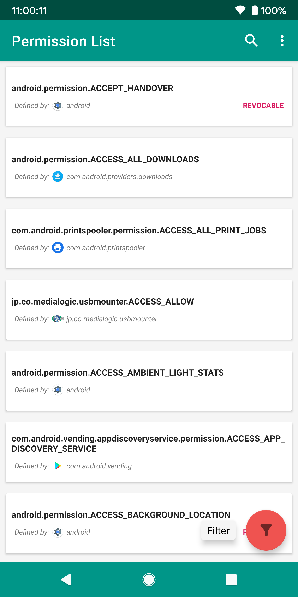
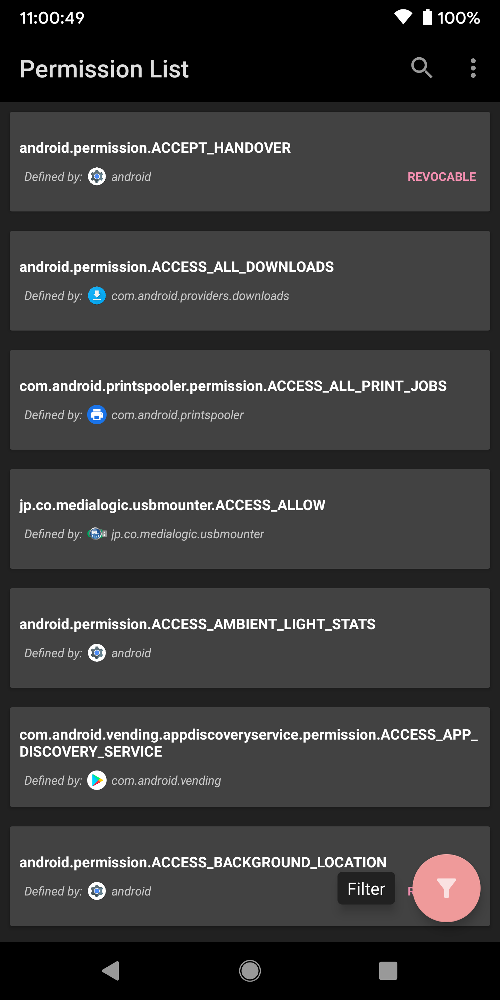

# Permission List by Yonder
Permission List displays every permission declared by every app installed on your device.
The permissions that are listed are declared by the displayed app. These permissions are
**not** displayed as they are **used** by each app, only
they are **declared** by each app. This is helpful on scoping out all the
permissions that are usable on your device and whether they are revocable. Permission List
is **not** an app manager.

# What is 'REVOCABLE'?
If a listed permission has a **REVOCABLE** tag
it means the permission is revocable from an app if it is using that permission. This
means you can deny this permission from the app via App Settings or adb.

# Usage
A list of permissions defined by every app will be loaded upon app initialization.
You can refresh this list at any time by pulling down on the list.
You can filter the list via the various filter options found in the filter Floating Action Button.
You can copy the information displayed on any list item as JSON by tapping it.
You can export all permissions in the list as a JSON file via `... -> Export List` (or, simply as a "save" icon if there is enough room).
You can change the theme via `... -> Theme -> (Auto, Light, Dark)`.

# Screenshots

# Building
There are customizations to the `clean` task for gradle to delete the `release` and `debug` APK output directories.
This was done due to a bug causing manifest conflicts after trying to build APKs after running the app via remote debugging.
For every build after debugging, run clean first, then run the APK build and it should work.
The build should be simple as Android Studio's `Build -> Geneate Signed Bundle/APK...`. 
The defualt configurations are fine although the Android Debug Key is used by default (this was for testing) so you might want to use your own key.

# Features
- Useful security tool
- Display all defined permissions by every app on your device.
- Find out what and what isnt a revocable permission on your device.
- Copy and export information displayed.
- Light Theme and Dark Theme

# Third Party Libraries
- [FastScroll by L4 Digital](https://github.com/L4Digital/FastScroll)
- [ExpandableFab by Nambi](https://github.com/nambicompany/expandable-fab)
- [Gson by Google](https://github.com/google/gson)</li>
